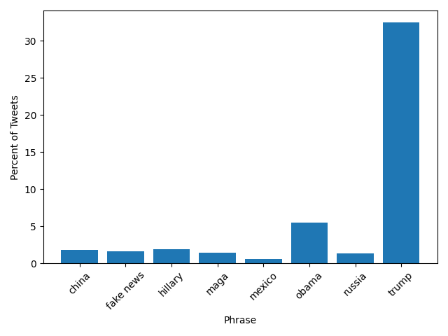
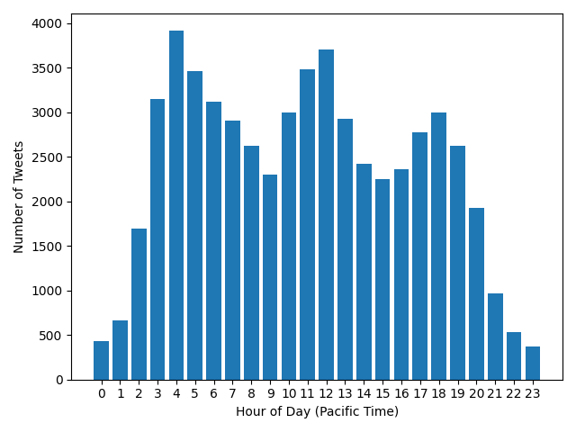
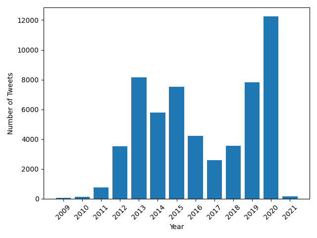

## Frequency of Key Phrases in Trump's Tweets
| phrase            | percent of tweets |
| ----------------- | ----------------- |
|             china | 01.82             |
|         fake news | 01.66             |
|           hillary | 01.93             |
|              maga | 01.45             |
|            mexico | 00.62             |
|             obama | 05.51             |
|            russia | 01.32             |
|             trump | 32.45             |

This table and chart show how frequently certain key words and phrases appear in Donald Trump's Twitter history from 2009 until 2021 (the most recently updated data from the Trump Twitter Archive).

## Trump's Tweets by Hour (Pacific Time)

This chart shows the distribution of Donald Trump's tweets by hour of day in Pacific Time.

## Trump's Tweets by Year

This chart shows the number of Donald Trump's tweets posted each year from 2009-2021 (Note Trump's Twitter ban in 2021).